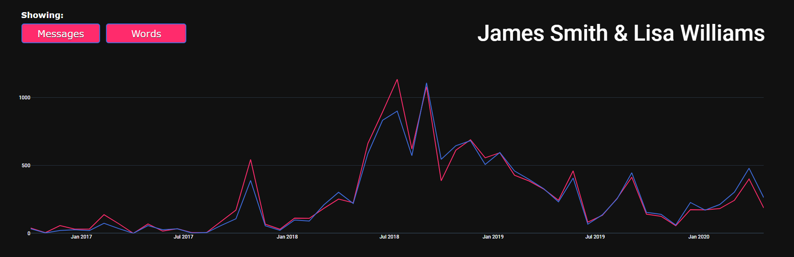
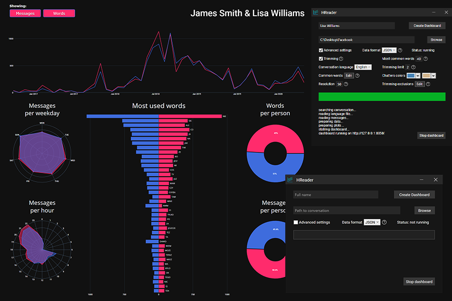

# HReader
Interactive data visualization tool for Facebook Messages.
# Build
- install all required modules - **pip install -r requirements.txt**
- compile python script to Windows executable with [compile_exe.bat](compile_exe.bat)
- compile HReader (GUI) in Visual Studio
# Use
To use this app you can:
- download and run the latest release which you can find [here](https://github.com/DawidPietrykowski/HReader/releases)
- build and run binary **bin/hreader.exe** 
- run the python script [fdash.py](fdash/fdash.py) with the arguments described in [argument_example.txt](fdash/argument_example.txt)
# How to download data from Facebook
- Log in to your account on [facebook](https://Facebook.com/)
- Navigate through Settings -> your Facebook Information -> Download your Information
- Media quality doesn't matter for this application
- This program works for both formats, but JSON is way faster and HTML still has some bugs and lacks some features
- After you make a request to create a file, it usually takes ~1-2 days until you can download it
- After downloading the files, unzip them somewhere - this will be your "Conversation directory"
# About
Inspired by r/dataisbeautiful, I decided to make my own data visualization tool to visualize Facebook Messages using the data you can download.

To make it, I used Python for all the data reading and calculations with Dash library for making the graphs and BeautifulSoup library for parsing HTML files. To create a simple UI, I made a C# program using WPF to display the inputs and the informations, and interact with the Python script that I converted to an exacutable using PyInstaller to work on machines without Python.

The user is presented with an interactive dashboard, which shows many interesing graphs and updates them in real-time after selecting a  timeframe on a main graph. The customization includes: changing colors for each person, enabling/disabling certain features and modifying graph parameters.

Tips, criticism or any feedback is most welcome.

# Image

App icon made by Kiranshastry from www.flaticon.com

# License and copyright

© Dawid Pietrykowski

Licensed under the [MIT LICENSE](LICENSE)

### If you enjoyed this project in any way, you can give me a cup of coffee :)

